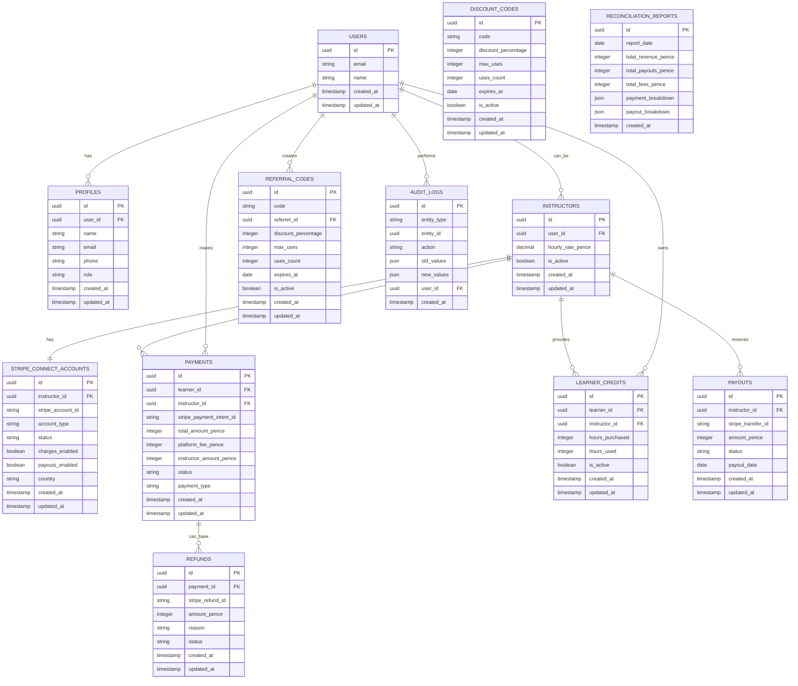

# LPlate Stripe Connect Database Schema

## Entity Relationship Diagram (ERD)

## Key Relationships Explained

### 1. **User Management**
- `USERS` → `PROFILES` (1:many) - Users can have multiple profiles
- `USERS` → `INSTRUCTORS` (1:many) - Users can be instructors

### 2. **Stripe Connect**
- `INSTRUCTORS` → `STRIPE_CONNECT_ACCOUNTS` (1:1) - Each instructor has one Stripe account
- `STRIPE_CONNECT_ACCOUNTS` stores Stripe-specific data (account ID, status, capabilities)

### 3. **Payment Flow**
- `USERS` → `PAYMENTS` (1:many) - Users make multiple payments
- `INSTRUCTORS` → `PAYMENTS` (1:many) - Instructors receive multiple payments
- `PAYMENTS` stores the 18% commission logic (platform_fee_pence)

### 4. **Credit System**
- `USERS` → `LEARNER_CREDITS` (1:many) - Users can have credits with multiple instructors
- `INSTRUCTORS` → `LEARNER_CREDITS` (1:many) - Instructors can have credits from multiple learners
- Credits are tied to specific instructor-learner pairs

### 5. **Payouts**
- `INSTRUCTORS` → `PAYOUTS` (1:many) - Instructors receive multiple payouts
- Automated Friday payout system

### 6. **Discounts & Referrals**
- `DISCOUNT_CODES` - Platform-wide discount codes
- `REFERRAL_CODES` - User-created referral codes with referrer tracking

### 7. **Audit & Reconciliation**
- `AUDIT_LOGS` - Tracks all changes for compliance
- `RECONCILIATION_REPORTS` - Financial reporting and reconciliation

## Commission Model
- **Learner pays:** `total_amount_pence` (instructor rate + 18% platform fee)
- **Platform keeps:** `platform_fee_pence` (18% of instructor rate)
- **Instructor receives:** `instructor_amount_pence` (full instructor rate)
